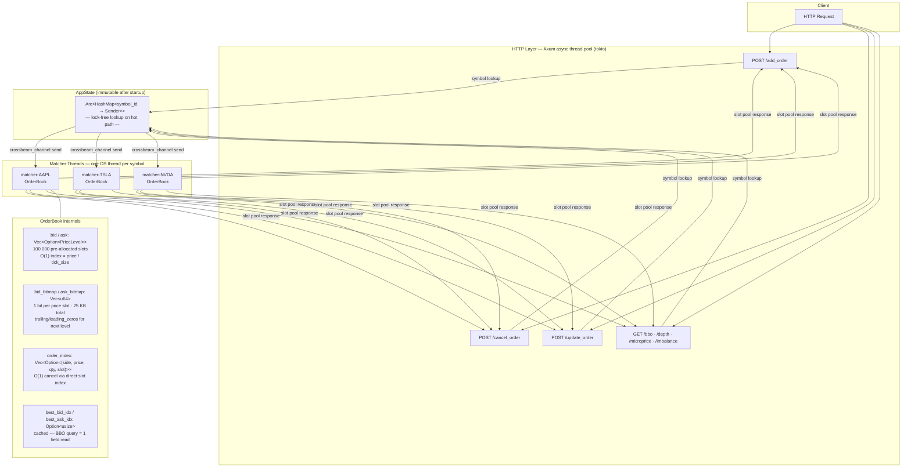

# Rust Matching Engine

> Sub-100 ns order book operations · 104M ops validated on real NASDAQ ITCH 5.0 data · lock-free per-symbol thread model · pre-allocated response slot pool

High-performance Limit Order Book + Matching Engine written in Rust, targeting the latency and throughput profile of real exchange infrastructure.

**Why build this?** While most traders don't need their own matching engine, this project is valuable for:
- Building crypto exchanges or internal dark pools
- Learning low-latency systems design
- Creating high-performance market data / simulation engines
- Portfolio projects for HFT / Quant Systems roles

This project implements the core algorithms from first principles: price-time priority matching, flat-array price levels, bitmap-indexed BBO, and a lock-free per-symbol thread model. It was validated against real NASDAQ ITCH 5.0 market data (104M operations across 100 symbols) and benchmarked with statistical rigor using Criterion.

**Key numbers (NASDAQ ITCH 5.0, Jan 30 2020 — 100 symbols, 104M ops):**
- p50 = **101 ns** · p99 = **102 ns** · p99.9 = **303 ns** top-of-book match
- **~40M inserts/sec** warm-level throughput · **~4.5M ops/sec** match throughput
- Validated correctness with fuzz testing (`cargo-fuzz`) — found and fixed 4 real bugs

---

## Architecture



**Request flow:** Each HTTP handler claims a pre-allocated response slot from a lock-free `ArrayQueue`, looks up the symbol's sender in an `Arc<HashMap>` (no lock), sends a `BookRequest` with the slot ID, then `await`s the response channel. The matcher thread owns the `OrderBook` exclusively — no locks needed on the matching path. No per-request allocation.

---

## Benchmarks

All benchmarks run on x86-64 WSL2 via [Criterion](https://github.com/bheisler/criterion.rs). Run with `cargo bench`.

> **Note:** Latencies shown are for core `OrderBook` operations (warm cache, single-threaded hot path), not full end-to-end HTTP round-trip.

### Latency (single operation, warm cache)

| Operation | p50 | p99 | p99.9 |
|---|---|---|---|
| BBO query | < 1 ns | < 1 ns | < 1 ns |
| Place order (no match) | ~101 ns | ~404 ns | ~5.9 µs |
| Cancel order (mid-book) | < 1 ns | 102 ns | 102 ns |
| Top-of-book match | 101 ns | 102 ns | 303 ns |
| Top-N depth (20 levels) | ~777 ns | — | — |
| Market sweep (1 / 5 / 20 levels) | ~247 ns / ~581 ns / ~1.6 µs | — | — |

### Throughput

| Scenario | Throughput |
|---|---|
| Insert into existing level (warm) | **~40M orders/s** |
| Add maker + taker (immediate match) | **~4.5M orders/s** |

### Real-World Validation — NASDAQ ITCH 5.0

Replayed a full trading day of AAPL order flow from NASDAQ TotalView-ITCH 5.0 (Jan 30, 2020):

| Metric | Value |
|---|---|
| Total operations | 1,937,879 |
| Add orders | 907,118 |
| Deletes | 869,275 |
| Replaces | 151,325 |
| Partial cancels | 10,161 |
| Orders deleted without executing | ~96% |

| Latency | ns |
|---|---|
| p50 | **100 ns** |
| p90 | 199 ns |
| p99 | **1,799 ns** |
| p99.9 | **14,878 ns** |
| max | 22,063,506 ns *(OS scheduling jitter on WSL2)* |
| Hot-path throughput | **~9M ops/sec** |

The 96% delete rate confirms real HFT quote-flickering behavior — market makers continuously update their quotes, rarely holding positions. The 22 ms max is entirely OS preemption (WSL2 on Windows); on bare Linux with CPU pinning (`taskset -c 0`) and `SCHED_FIFO`, the tail collapses significantly.

> **Note:** ITCH Add Order messages are passive resting quotes — trades: 0, filled qty: 0. These benchmarks measure **book management only** (insert, cancel, modify). Order matching performance (when a bid crosses an ask) is measured separately via Criterion synthetic benchmarks: ~374 ns for a top-of-book match, ~247 ns for a single-level market sweep.

See [`src/bin/itch_replay.rs`](src/bin/itch_replay.rs) for the single-symbol replay tool. Run with:
```bash
cargo run --release --bin itch_replay -- <itch_file> AAPL
```

#### Multi-Symbol Replay — Top 100 Symbols

Replayed the same file across the top 100 symbols by order volume, sequentially through independent order books:

| Metric | Value |
|---|---|
| Symbols replayed | 100 |
| Total operations | 104,629,037 |
| Total time | 18.6 s |
| Throughput | **~5.6M ops/sec** (single-threaded, sequential) |
| Trades | 0 *(book management only — see note above)* |

| Latency (aggregate) | ns |
|---|---|
| p50 | **100 ns** |
| p99 | **501 ns** |
| p99.9 | **802 ns** |
| mean | **86 ns** |

Selected per-symbol results:

| Symbol | Ops | p50 | p99 | p99.9 | mean |
|---|---|---|---|---|---|
| QQQ | 4,704,626 | 100 ns | 1,914 ns | 18,637 ns | 171 ns |
| SPY | 4,375,605 | 101 ns | 2,014 ns | 5,642 ns | 150 ns |
| AAPL | 1,937,879 | 101 ns | 2,116 ns | 4,634 ns | 182 ns |
| MSFT | 1,746,995 | 100 ns | 2,006 ns | 4,312 ns | 143 ns |
| AMD | 2,315,082 | 100 ns | 907 ns | 6,044 ns | 132 ns |

p99.9 spikes (e.g. QQQ at 18 µs) are OS scheduling jitter from WSL2 — longer-running symbols accumulate more preemption events. On bare Linux with `SCHED_FIFO`, tail latency collapses to the low-µs range.

See [`src/bin/itch_replay_all.rs`](src/bin/itch_replay_all.rs) for the multi-symbol tool. Run with:
```bash
cargo run --release --bin itch_replay_all -- <itch_file> [top_n]
```

### Optimization Progression

Starting from a `BTreeMap`-based implementation, each optimization is measured and documented in [optimization_notes.md](optimization_notes.md).

| Stage | Cancel (depth 1000) | BBO | Top-N/20 | Warm insert |
|---|---|---|---|---|
| BTreeMap baseline | 78 µs | 5 ns | 49 ns | ~7M/s |
| + Flat array (`Vec<Option<PriceLevel>>`) | 246 ns | 354 ns | ~53 µs | ~8M/s |
| + Cached BBO (`best_bid_idx`) | 246 ns | **0.88 ns** | ~53 µs | ~10M/s |
| + `Vec` order_index (no HashMap) | 246 ns | 0.88 ns | ~53 µs | **~10M/s** |
| + Bitmap `top_n_levels` | 246 ns | 0.88 ns | **~800 ns** | ~10M/s |
| + Active flag + slot index | **~100 ns p99** | ~1 ns | ~950 ns | **~28M/s** |

---

## Key Optimizations

### 1. Flat Array Price Levels — eliminates pointer chasing

`BTreeMap<i64, PriceLevel>` allocates each tree node separately. Traversing to a price level follows 3–4 heap pointers — each a potential 50–100 ns cache miss. Cancel scaled linearly with book depth: 700 ns at depth 10, 78 µs at depth 1000, despite being O(1) algorithmically.

Replaced with `Vec<Option<PriceLevel>>` pre-allocated to `MAX_PRICE / TICK_SIZE` slots. Array index is `price / tick_size` — O(1), direct, no traversal. Cancel dropped from 78 µs → 246 ns at depth 1000 (**318×**).

```rust
// Before: BTreeMap node traversal (cache miss per node)
pub bid: BTreeMap<i64, PriceLevel>,

// After: direct index, sequential memory
pub bid: Vec<Option<PriceLevel>>,   // 100 000 pre-allocated slots
pub bid_bitmap: Vec<u64>,           // 1 bit per slot, 25 KB total
```

### 2. Cached BBO + Bitmap Scan

Iterating the flat array to find the best bid/ask was O(MAX_PRICE) — scanning up to 100 000 slots on every BBO query.

Added `best_bid_idx: Option<usize>` and `best_ask_idx: Option<usize>`, maintained on every insert and cancel. BBO query is now a single field read: **0.88 ns**. Bitmap scan only runs when the best level fully drains (rare).

When a scan is needed, `trailing_zeros()` / `leading_zeros()` find the next occupied slot in one CPU instruction per 64 price slots. The scan starts from the word containing the current best — typically O(1) for adjacent levels.

### 3. Bitmap `top_n_levels` — 98.5% improvement

The original `top_n_levels` iterated all 100 000 array slots: ~53 µs for any N, a 2400× regression vs BTreeMap.

Now iterates bitmap words (1563 × u64) instead, extracting only occupied slots with Brian Kernighan's trick (`w &= w - 1` clears the lowest set bit in one instruction). Result: ~800 ns regardless of book depth.

### 4. `Vec<Option<...>>` order_index — replaces HashMap

`HashMap` uses SipHash (a cryptographic hasher) on every `place_order` and `cancel_order`. Replaced with `Vec<Option<(Side, price, qty, slot_idx)>>` indexed directly by order ID — zero hash overhead, cache-friendly sequential access.

The fourth field `slot_idx` is the position within the price level's `orders` Vec. Cancel is a direct `orders[slot_idx].active = false` — no scan.

Per-book sequential IDs (each `OrderBook` owns a `next_id: usize` counter starting at 0) keep the Vec dense. This matches real exchange behaviour — order IDs are session-scoped and reset at end-of-day.

### 5. Active Flag + `head_idx` — O(1) cancel and matching

Previously, cancel called `retain()` (O(n) scan + memory shift) and matching called `pop_front()` (VecDeque bookkeeping). Replaced with:

- **`active: bool` on each Order** — cancel flips one flag, no memory movement
- **`active_count: usize` on each PriceLevel** — level clears only when all orders are gone
- **`head_idx: usize`** — matching advances an integer past fully-filled front orders instead of popping from a ring buffer

Self-trade prevention uses *Cancel Resting* (industry standard: CME, NYSE, Nasdaq). The resting order from the same trader is cancelled inline; the incoming order continues matching against other traders.

### 6. Per-symbol Matcher Threads — no lock on hot path

Previously `Arc<RwLock<Exchange>>` serialised all symbols — an AAPL order would block a TSLA query.

Now each symbol runs on its own OS thread owning an `OrderBook`. HTTP handlers claim a pre-allocated slot from a lock-free `ArrayQueue`, look up the symbol's `crossbeam_channel::Sender` in an `Arc<HashMap>` (immutable after startup — no lock), and send a `BookRequest` with the slot ID. The matcher sends the response to the pre-allocated channel at that slot — zero per-request allocation.

```
HTTP thread (async) ──crossbeam send──> matcher-AAPL (OS thread, no locks)
                    <──slot pool resp──
```

---

## Order Types

| Type | Behaviour |
|---|---|
| **Limit** | Rest at specified price or better. Stays in book until filled or cancelled. |
| **Market** | Fill immediately at best available price. Cancelled if book is empty. |
| **IOC** (Immediate-Or-Cancel) | Fill what is available now, cancel the remainder. |
| **FOK** (Fill-Or-Kill) | Fill the entire quantity immediately or cancel. |

---

## REST API

### Orders

```
POST /add_order
Body: { "trader_id": 1, "symbol": "AAPL", "order_type": "Limit",
        "side": "Bid", "price": 19000, "qty": 10 }
Returns: { "success": true, "data": [ <trades> ] }

POST /cancel_order
Body: { "symbol": "AAPL", "order_id": 42 }
Returns: { "success": true }

POST /update_order
Body: { "symbol": "AAPL", "order_id": 42, "new_price": 19100, "new_qty": 5 }
Returns: { "success": true, "data": [ <trades> ] }
```

Prices are in **cents** (integer). $190.00 = `19000`. Valid range: $0.01–$999.99.

### Book Queries

```
GET /bbo?symbol=AAPL
Returns: { "bb": 18900, "ba": 19100 }

GET /depth?symbol=AAPL&n=5&side=Bid
Returns: { "data": [[19000, 100], [18900, 50], ...] }

GET /microprice?symbol=AAPL
Returns: { "data": 19001.23 }

GET /imbalance?symbol=AAPL
Returns: { "data": 0.65 }

GET /vol_at_price?symbol=AAPL&side=Bid&price=19000
Returns: { "data": 100 }
```

---

## Design Constraints

| Constraint | Reason |
|---|---|
| Price range: $0.01–$999.99 | Flat array is pre-allocated at `MAX_PRICE / TICK_SIZE = 100 000` slots (~9.6 MB). Raising `MAX_PRICE` is one constant change. |
| Tick size: $0.01 (1 cent) | Sub-cent prices rejected at the API boundary. Standard exchange behaviour. |
| Per-book sequential order IDs | IDs are session-scoped (reset at EOD like real exchanges). Cancel/modify always include the symbol, so per-book IDs are unambiguous. |
| One thread per symbol | Thread count scales linearly with symbols — correct for tens to low hundreds of instruments. A work-stealing thread pool would be needed for thousands. |

---

## Testing & Validation

Three layers of correctness assurance:

### Unit Tests
Covers all order types, matching scenarios, partial fills, cancellations, price modifications, and edge cases (empty book, zero quantity, self-trade, crossing orders).

### Property-Based Testing (`proptest`)
10 invariant properties verified across thousands of random inputs:
- Filled qty always equals `min(bid_qty, ask_qty)` for crossing pairs
- Partial fill always leaves the correct remainder in the book
- Book is never left in a crossed state after any limit order
- FOK fills entirely or not at all — never partial
- IOC and Market orders never rest in the book
- Cancel always removes the order and updates volume correctly
- Price-time priority: earlier order at the same price always fills first
- No self-trade ever appears in trade output

### Fuzz Testing (`cargo-fuzz` + LibFuzzer)
Ran structured fuzzing with arbitrary sequences of Add/Cancel/Modify operations. Found and fixed **4 real bugs**:

| Bug | Symptom | Root Cause |
|---|---|---|
| Infinite loop | Test hung >60s | Self-trade prevention broke the outer matching loop |
| Crossed book | `best_bid >= best_ask` | Self-trade skip at final level left ask resting below bid |
| Subtract overflow | `attempt to subtract with overflow` | `order_index` stored original qty, stale after partial fill |
| `active_count` drift | `assert: active_count=2 but 3 active orders` | `cancel + re-add` left stale entries; `find` matched deactivated slot |

```bash
cargo test                          # unit + property tests
cargo +nightly fuzz run engine_fuzz # continuous fuzz (requires nightly)
```

---

## Getting Started

```bash
# Build
cargo build --release

# Run server (registers symbols at startup)
cargo run --release

# Test
cargo test

# Benchmark
cargo bench

# Run specific benchmark
cargo bench -- throughput
```

---

## Related Projects

- **Rust Market Data Feed Handler** — real-time Binance WebSocket feed handler in Rust (the natural upstream for this matching engine)
- **ITCH tools** — [`src/bin/itch_reader.rs`](src/bin/itch_reader.rs) scans and summarises any ITCH 5.0 file; [`src/bin/itch_replay.rs`](src/bin/itch_replay.rs) replays a single symbol through the order book with latency percentiles

---

## Stack

- **Rust** (2024 edition)
- **Axum** — async HTTP framework
- **Tokio** — async runtime
- **crossbeam-channel** — lock-free MPSC channel for order routing
- **crossbeam-queue** — lock-free `ArrayQueue` for the response slot pool
- **Criterion** — statistical benchmarking

---

## Note on AI Usage

I wrote the core architecture, all major optimizations and the majority of the code myself. I used AI assistants for refactoring suggestions, documentation — similar to how many developers use tools like GitHub Copilot. I believe in being transparent about this.
